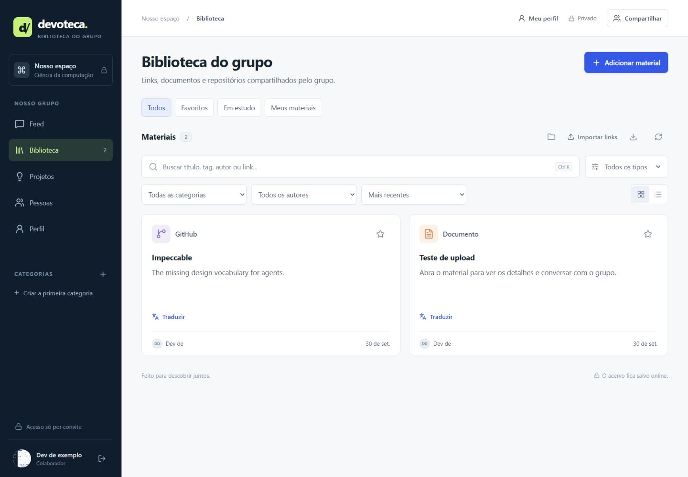

# Devoteca

Biblioteca colaborativa para guardar as referências que costumam se perder nas conversas de um grupo de estudos de ciência da computação.

O projeto organiza repositórios GitHub, artigos, cursos, vídeos, ferramentas e documentos em um acervo compartilhado, com acesso por convite e preferências individuais de estudo.



**Aplicação publicada:** [Devoteca](https://devoteca-grupo.vittorjsc.chatgpt.site/). A instância do grupo é privada e exige uma conta ChatGPT convidada. Para avaliar o projeto, veja a captura acima ou execute uma cópia local seguindo o guia abaixo.

## Funcionalidades

- Cadastro e edição de materiais com título, descrição, tipo, categoria e tags.
- Busca por título, descrição, URL, autor e tags, com normalização de acentos.
- Filtros combinados, ordenação e visualizações em cartões ou lista.
- Categorias personalizáveis e prevenção de links duplicados.
- Preenchimento de metadados de repositórios públicos do GitHub.
- Anexos de até 20 MB, com download protegido pelo acesso à biblioteca.
- Favoritos e progresso de leitura separados por usuário.
- Comentários compartilhados e permissões de edição por autor ou administrador.
- Tradução de páginas, descrições e trechos para português pelo Google Tradutor, em outra aba.
- Ideias de projetos com nome, descrição, inspiração, links, tecnologias, próximos passos e status.
- Edição das ideias por todos os convidados, referência a materiais do acervo, busca, filtros e exportação JSON.
- Importação de até 50 links por lote e exportação do catálogo em JSON.
- Interface responsiva em português.
- Feed cronológico com publicações de texto e fotos, materiais da biblioteca e ideias de projetos, com filtros e paginação.
- Perfil pessoal com nome, foto e biografia, além do histórico de contribuições de cada membro.
- Publicações editáveis pelo autor ou administrador; perfis editáveis apenas pela própria pessoa.

## Tecnologias e arquitetura

| Camada | Tecnologias / responsabilidade |
| --- | --- |
| Interface | React 19, TypeScript, CSS, Radix UI e Lucide |
| Aplicação | Vinext, rotas compatíveis com Next.js e Vite |
| Execução | Cloudflare Workers |
| Banco de dados | Cloudflare D1 (SQLite), esquema e migrações Drizzle |
| Anexos | Cloudflare R2 |
| Acesso da instância publicada | Gateway privado do Sites e conta ChatGPT |
| Verificação | TypeScript, testes de integração do Worker local e GitHub Actions |

A interface chama as rotas em `app/api/`. As rotas validam identidade, origem, campos e autorização antes de consultar o D1 ou enviar anexos para o R2. Materiais, comentários e categorias são compartilhados; favoritos e progresso de leitura são associados ao usuário. A identidade interna preserva o ID da plataforma ou deriva uma chave opaca do e-mail autenticado quando o ID opcional não está disponível.

## Executar localmente

Requisitos: **Node.js 22.13 ou superior** e npm. O Wrangler usa D1 e R2 locais; não é necessário conectar uma conta Cloudflare para o desenvolvimento local.

```sh
git clone https://github.com/vittorjsc/devoteca.git
cd devoteca
npm run install:ci
npm run build
npm run db:migrate:local
npm run db:migrate:projects
npm run db:migrate:community
npm run dev
```

Abra [o login de desenvolvimento](http://127.0.0.1:5173/signin-with-chatgpt?return_to=/) para entrar com o usuário local de demonstração. O acervo local começa vazio. Crie categorias e salve seus primeiros materiais. A migração inicial deve ser aplicada uma única vez por banco local; depois use as próximas migrações em ordem.

O administrador local padrão é `seedy@sites.test`. Para configurar outra identidade, copie `.dev.vars.example` para `.dev.vars` e defina `DEVOTECA_ADMIN_EMAIL`. O arquivo de configuração real é ignorado pelo Git.

## Verificar

```sh
npm run typecheck
npm run build
npm run db:migrate:local
npm start -- --port 8787
```

Em outro terminal:

```sh
npm run test:integration
npm run test:projects
npm run test:community
node --experimental-strip-types --test tests/translation.test.mjs
```

Os testes cobrem login obrigatório, cadastro/edição/exclusão, duplicatas, URLs inválidas, isolamento entre autores, favoritos e progresso individuais, comentários, exclusão em cascata, proteção de origem e envio/download de anexos. O script recusa destinos fora de localhost. Os cabeçalhos de identidade simulados são exclusivos do teste do Worker local.

Os testes de projetos verificam o acesso privado, a edição compartilhada, a validação dos campos e links, a exclusão pelo autor e a preservação das ideias quando um material de inspiração é removido. Para uma cópia local já existente, aplique a migração `db:migrate:projects` apenas uma vez antes de usar a nova área. Na interface, abra **Ideias de projetos → Nova ideia**. Todos os convidados podem editar; a exclusão é reservada ao autor ou administrador.

Os testes da comunidade verificam o feed combinado em ordem cronológica, a paginação, a persistência dos perfis, as permissões de edição e exclusão, a privacidade das fotos e sua remoção quando deixam de ser usadas. Para uma cópia local já existente, aplique `db:migrate:community` uma única vez depois das migrações anteriores.

Na aba **Feed**, escreva uma mensagem e use **Adicionar foto → Publicar**. Cada post aceita até 3.000 caracteres e uma foto JPG, PNG ou WebP de até 5 MB. **Meu perfil → Editar perfil** permite mudar nome (até 60 caracteres), biografia (até 500) e foto. Clique no autor para ver suas contribuições. As fotos são servidas por uma rota autenticada; uploads ainda não publicados ficam disponíveis apenas para seu dono. O feed atualiza a primeira página quando visível; ao carregar histórico, os itens permanecem abertos até atualizar manualmente ou trocar de filtro.

O workflow de CI instala as dependências fixadas no lockfile, verifica os tipos, testa a criação dos links de tradução e compila a aplicação. Os testes de integração são executados com o Worker e o banco locais pelo procedimento acima.

## Estrutura do código

```text
app/                  interface e rotas HTTP
  api/                materiais, categorias, comentários, arquivos e GitHub
db/                   esquema relacional
drizzle/              migrações versionadas
lib/library.ts        identidade, validação, persistência e erros
build/                integração do starter com Workers e preview local
scripts/              instalação, execução e ambiente de desenvolvimento
tests/integration.mjs testes do Worker local
docs/                 captura da aplicação
```

## Publicação e limites

A autenticação publicada depende do gateway do Sites: ele verifica os convites e encaminha a identidade ao Worker. Publicar este código diretamente em outro provedor exige um gateway confiável ou implementar uma autenticação própria. Não exponha o Worker de testes ou aceite cabeçalhos de identidade enviados por visitantes na internet. A simulação de login é restrita ao desenvolvimento local.

Este repositório contém o código e o esquema, sem dados do grupo, convites, credenciais, anexos ou identificação da hospedagem privada. A configuração `.openai/hosting.json` declara apenas os bindings lógicos `DB` e `BUCKET`. Ao provisionar uma nova instância no Sites, use a identidade e os recursos retornados para essa nova instância.

- Metadados do GitHub são consultados somente para repositórios públicos.
- A tradução abre o Google Tradutor por escolha do usuário. Documentos devem ser baixados e selecionados manualmente no tradutor; nenhum anexo é enviado automaticamente.
- A exportação JSON contém os metadados do catálogo; anexos e comentários não fazem parte de um backup completo.
- Os formatos aceitos de anexo incluem PDF, TXT, MD, DOC/DOCX, PPT/PPTX, XLS/XLSX, CSV, ZIP e imagens PNG/JPEG/WebP.
- A versão usa Vinext em beta; o lockfile registra as versões utilizadas.

## Sobre o projeto

Projeto de portfólio de [João Vittor](https://github.com/vittorjsc), construído com apoio do Codex a partir de uma necessidade real de organização de referências entre amigos. O código de integração do starter e os estilos de terceiros mantêm seus avisos de licença em `build/sites-vite-plugin.LICENSE` e `vendor/`.
